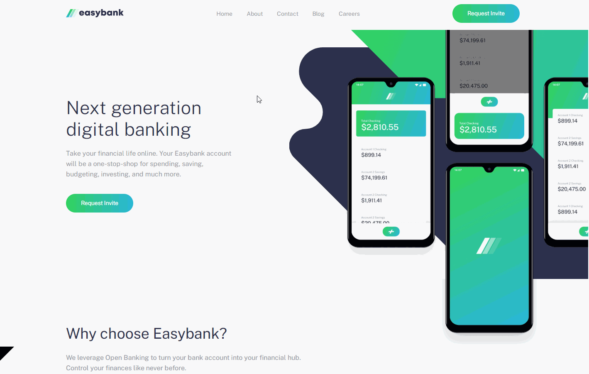
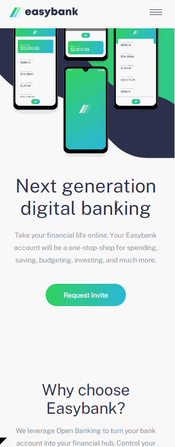

# Frontend Mentor - Easybank landing page solution

This is a solution to the [Easybank landing page challenge on Frontend Mentor](https://www.frontendmentor.io/challenges/easybank-landing-page-WaUhkoDN). Frontend Mentor challenges help you improve your coding skills by building realistic projects. 

## Table of contents

- [Overview](#overview)
  - [The challenge](#the-challenge)
  - [Preview](#preview)
  - [Links](#links)
- [My process](#my-process)
  - [Built with](#built-with)
  - [Useful resources](#useful-resources)
- [Author](#author)

## Overview

### The challenge

Users should be able to:

- View the optimal layout for the site depending on their device's screen size
- See hover states for all interactive elements on the page

### Preview

Desktop Preview

;

Mobile Preview

;

### Links

- Solution URL: [Add solution URL here](https://your-solution-url.com)
- Live Site URL: [Add live site URL here](https://your-live-site-url.com)

## My process

### Built with

- Semantic HTML5 markup
- Flexbox
- CSS Grid
- Mobile-first workflow
- Intersection Observer

### Useful resources

- [Youtube Video Kevin Powell](https://www.youtube.com/watch?v=T8EYosX4NOo) - Introduction to Intersection Observer from Kevin Powell
- [Blog Article Text Gradient](https://cssgradient.io/blog/css-gradient-text/) - Blog Article for using CSS Gradient on Text

## Author

- Frontend Mentor - [@JustCode11](https://www.frontendmentor.io/profile/JustCode11)
